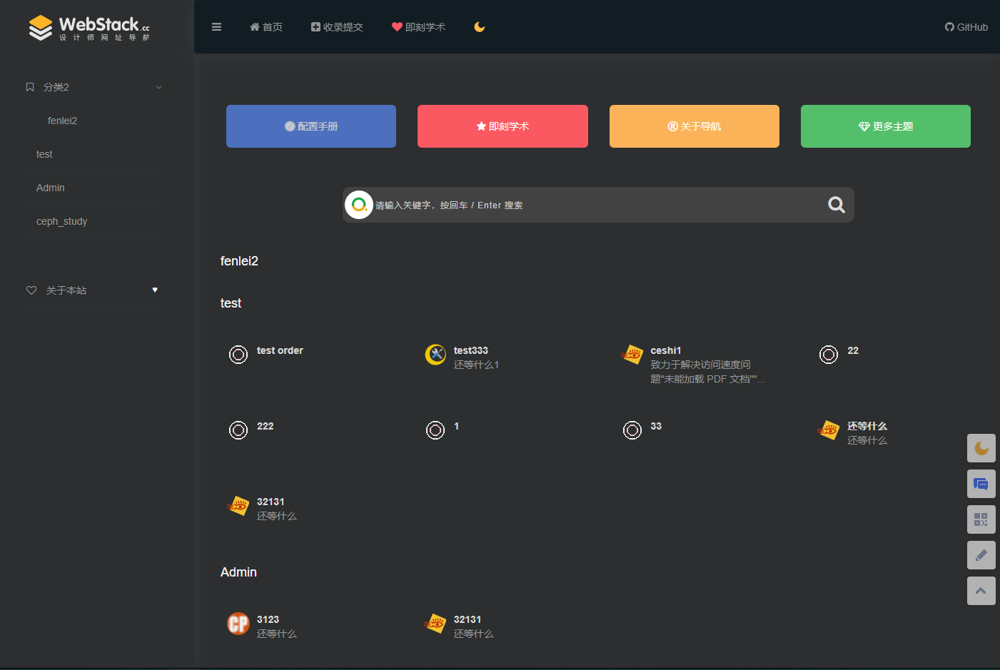
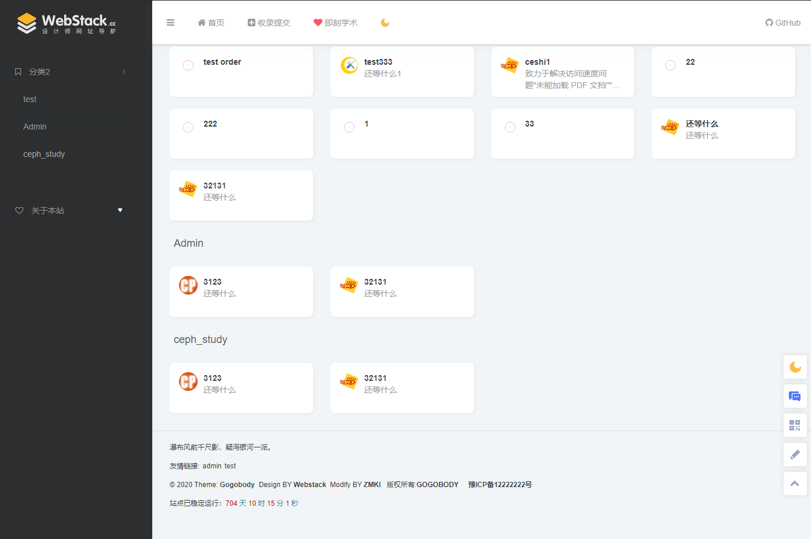
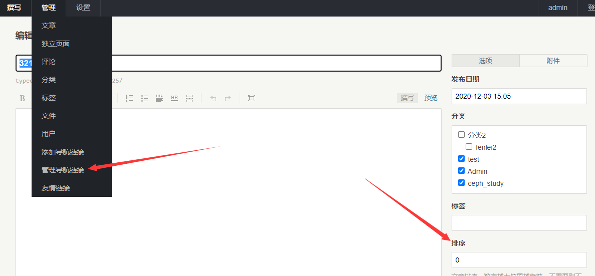

# WebStack
WebStack for typecho 导航主题

## demo
[即刻学术导航](https://scholar.ijkxs.com)

## 
基于WebStack.cc 开发， 支持 typecho ，无需改动源码  

## 特点：
1. 精简了80%以上无用css和js
2. 支持大量自定设置
3. 黑夜模式
4. 支持导航排序
5. 更快速的懒加载

## 预览
   

  
~  

## 使用方法
下载 github 最新 release  
分别安装包里的 插件和主题

## 如何对分类排序？
typecho 分类直接拖

## 如何对导航排序？
看图：  

## 顶部小模块图标设置引导:
前往[http://www.fontawesome.com.cn/icons-ui/](http://www.fontawesome.com.cn/icons-ui/)，找到你喜欢的图标，复制名称后填入 主题设置对应的模块图标  
如：fa fa-registered

## 首页导航分类图标设置引导:
导航分类名称前的图标也是同理，不过要复制的是图标名称 而不是class内的内容。  
和上面略有不同，如：(fa fa-registered) 应该填 (registered)
